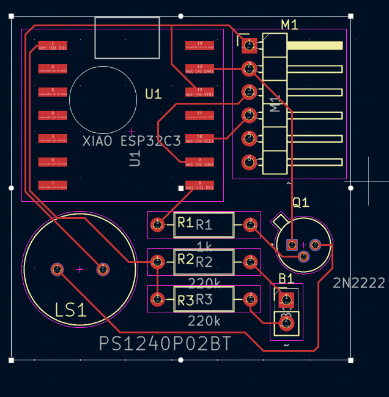
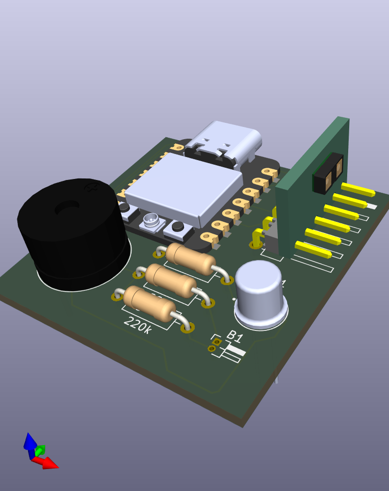
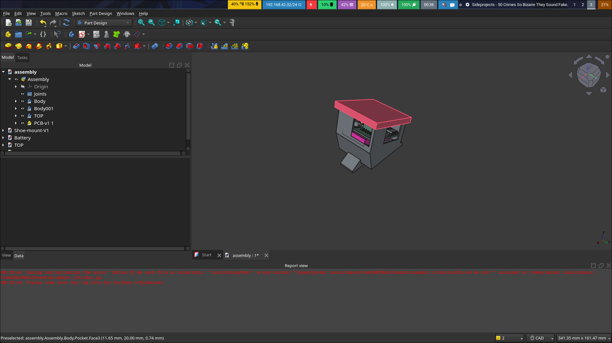
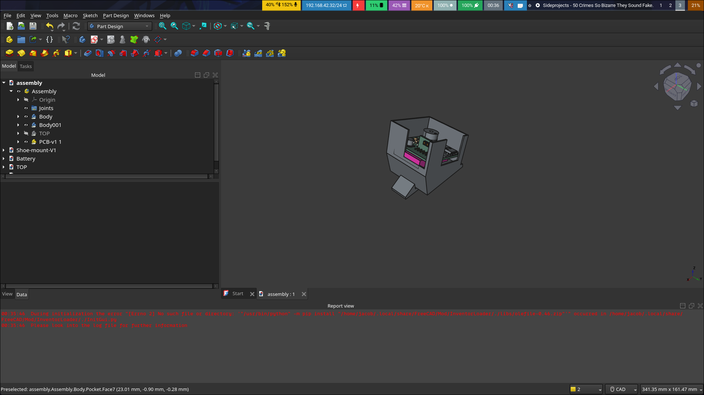

# StepSense
StepSense is a pod that attaches to a shoe and warns the wearer through an audible alarm that they are about to walk into something.
# Why
I made this project after seeing many of my friends and myselfwalk into wallsor other obstacleswhilelooking down at a phone. The idea is that it rests on the shoe and warns the wearer of a potential obstacle.
# Pictures

# BOM
| Reference | Qty | Footprint | Link | Supplier |
| --- | --- | --- | --- | --- |
| B1 | 1 | Connector_PinHeader_1.00mm:PinHeader_1x02_P1.00mm_Horizontal | https://www.amazon.com/YTKavq-Battery-Lithium-Rechargeable-Connector/dp/B08TTXX1W4?s=electronics | Amazon |
| LS1 | 1 | PS1240P02BT:XDCR_PS1240P02BT | https://www.aliexpress.us/item/3256808371712170.html?utparam-url=scene%3Asearch%7Cquery_from%3A%7Cx_object_id%3A1005008558026922%7C_p_origin_prod%3A1005008129032384 | Aliexpress |
| M1 | 1 | Connector_PinHeader_2.54mm:PinHeader_1x06_P2.54mm_Horizontal | https://www.aliexpress.us/item/3256806005285334.html?utparam-url=scene%3Asearch%7Cquery_from%3A%7Cx_object_id%3A1005006191600086%7C_p_origin_prod%3A | Aliexpress |
| Q1 | 1 | 2N2222:TO127P584H533-3 | https://www.aliexpress.us/item/3256807891334673.html?utparam-url=scene%3Asearch%7Cquery_from%3A%7Cx_object_id%3A1005008077649425%7C_p_origin_prod%3A1005009744071978 | Aliexpress |
| R1,R2,R3 | 3 | Resistor_THT:R_Axial_DIN0207_L6.3mm_D2.5mm_P10.16mm_Horizontal | https://www.amazon.com/Avelis-Resistors-Assortment-Precision-Electronic/dp/B0FNRD8B3X | Amazon |
| U1 | 1 | XIAO_ESP32C3:xiao_esp32c3 | https://www.seeedstudio.com/Seeed-Studio-XIAO-ESP32C3-Tape-Reel-p-6471.html | Seeed Technology |
| Custom PCB | 1 | | PCB-v1/ | PCBWAY |
